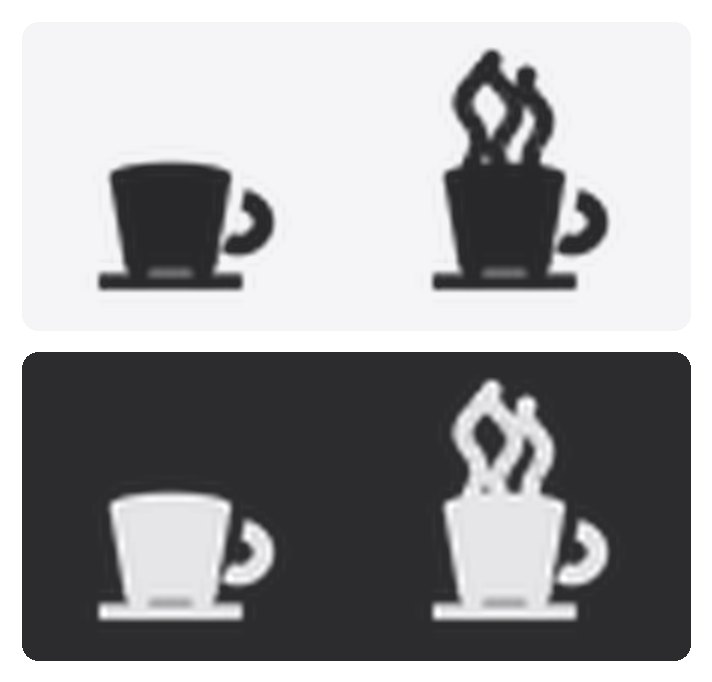

# ☕ Stay Awake (menu bar)

[](https://github.com/christopherapeterson/stay-awake-menubar/actions/workflows/ci.yml)
[](https://www.python.org/)
[](https://www.apple.com/macos/)
[](LICENSE)

A self-contained **Stay Awake** component for a `rumps` macOS menu bar app, plus a
minimal host app that shows it living alongside a dictation tool. Works like
Caffeine / Amphetamine: it keeps your Mac (and display) awake by managing a single
`caffeinate` subprocess.

<p align="center">
  
</p>

A groovy little coffee cup sits in your menu bar. It's empty when your Mac is free
to sleep, and pours out wavy 70s steam while Stay Awake is keeping it up. The icons
are template images, so they tint themselves for light and dark menu bars.

## Files

- **`stay_awake.py`** — the self-contained component. Drop this into any existing
  rumps app. It owns its menu items and its `caffeinate` process; it does not
  touch your dictation code.
- **`main.py`** — a minimal host app (Dictation) demonstrating the wiring.
- **`test_stay_awake.py`** — headless lifecycle test (no GUI loop needed).
- **`scripts/make_icons.py`** — regenerates the groovy menu bar icons in
  `Resources/` (committed, so you only need this to tweak the art).

## Run

```bash
python3 -m venv .venv
./.venv/bin/pip install -r requirements.txt
./.venv/bin/python main.py
```

A `🎤` appears in the menu bar. Click it for:

- **Start Dictation** — stand-in for the real dictation tool.
- **Stay Awake** — toggle: keeps the Mac awake indefinitely. The title flips to
  `☕` and the item gets a checkmark while active. Click again to turn off.
- **Stay awake for...** — submenu of presets: **15 minutes**, **1 hour**,
  **4 hours**, **Until turned off**. Timed sessions auto-revert when they expire.

## Integrating into your own app

```python
import rumps
from stay_awake import StayAwake

class App(rumps.App):
    def __init__(self):
        super().__init__("Dictation", title="🎤", quit_button=None)
        self.stay_awake = StayAwake(self)
        self.menu = [
            "Start Dictation",
            None,
            *self.stay_awake.menu,      # toggle + duration submenu
            None,
            rumps.MenuItem("Quit", callback=self.quit),
        ]

    def quit(self, _):
        self.stay_awake.shutdown()
        rumps.quit_application()
```

## How it stays clean

- **Exactly one `caffeinate`** ever runs — toggling or picking a new duration
  tears down the previous one first, so assertions never stack.
- **Never orphaned.** Every `caffeinate` is launched with `-w <our pid>`, so macOS
  releases the assertion the instant our process exits — even on `kill -9`. On top
  of that, `atexit` + SIGTERM/SIGINT handlers kill it on any catchable exit.
- **Timed sessions** use caffeinate's own `-t <seconds>`; a 1s `rumps.Timer` polls
  on the main thread and reverts the icon when the process exits on its own. No
  background thread ever touches the UI.

## Test

```bash
./.venv/bin/python test_stay_awake.py
```

## Regenerating the icons

The icons are committed under `Resources/`, so you only need this to change the
art. The generator uses Pillow:

```bash
./.venv/bin/pip install Pillow
./.venv/bin/python scripts/make_icons.py
```

It writes `stay-awake-idle` and `stay-awake-active` at 1x and `@2x`, drawn as
black-on-transparent template images so the menu bar handles light/dark tinting.
